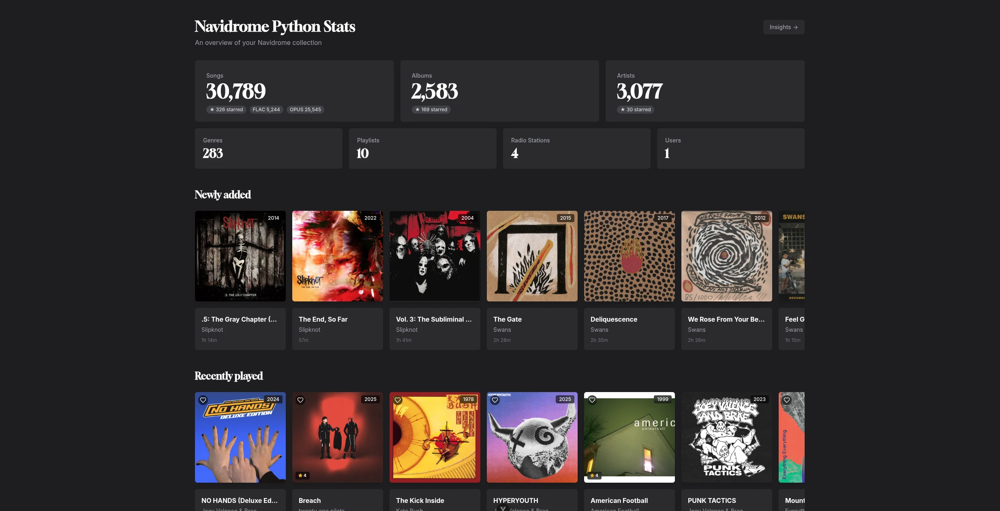

# Navidrome Python Statistics



## Python

### Setup

```bash
# 1. Create and activate virtual environment
python -m venv .venv && source .venv/bin/activate

# 2. Install dependencies
pip install -e .

# 3. Copy example environment variables and fill in the values
cp .env.example .env
```

### Development

```bash
uvicorn main:app --app-dir src --reload
```

### Environment Variables

- `NAVIDROME_URL`
- `NAVIDROME_USER`
- `NAVIDROME_PASSWORD`

## Vue

## Setup

```bash
# Install dependencies
bun install
```

### Development

```bash
bun dev
```
